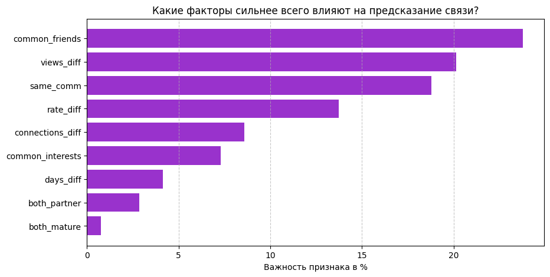

# 🎯 Link Prediction in Twitch Social Network

[](https://www.python.org/downloads/)
[](https://catboost.ai/)
[]()

Модель машинного обучения для предсказания вероятности подписки между пользователями Twitch.

---

## 📊 Ключевые результаты

| Метрика | Значение |
|---------|----------|
| **AUC-ROC** | **0.9038** |
| **Accuracy** | **84%** |
| **Precision (class 1)** | 0.87 |
| **Recall (class 1)** | 0.80 |
| **Время обучения** | 8.05 сек |
| **Размер выборки** | 74,608 пар |

---

## 🧠 Методология

### 1. Построение графа
- **Узлы**: пользователи Twitch
- **Ребра**: существующие подписки
- **Граф строится ТОЛЬКО на обучающей выборке** (без утечки данных)
- **Библиотека**: NetworkX

### 2. Признаки узлов

| Признак | Описание | Источник |
|---------|----------|----------|
| `connections` | Количество подписчиков | NetworkX (degree) |
| `rate` | Важность узла в графе | NetworkX (PageRank) |
| `community` | Сообщество пользователя | Louvain algorithm |
| `days` | Возраст аккаунта | Профиль пользователя |
| `mature` | Взрослый контент (0/1) | Профиль пользователя |
| `partner` | Партнер Twitch (0/1) | Профиль пользователя |
| `views` | Количество просмотров | Профиль пользователя |

### 3. Признаки пар (9 признаков)

| Признак | Описание | Важность |
|---------|----------|----------|
| **common_friends** | Количество общих друзей | **23.8%** |
| **views_diff** | Разница в просмотрах | **20.1%** |
| **same_comm** | В одном сообществе | **18.8%** |
| **rate_diff** | Разница в PageRank | **13.7%** |
| **connections_diff** | Разница в подписчиках | **8.6%** |
| **common_interests** | Общие интересы (теги) | **7.3%** |
| **days_diff** | Разница в возрасте аккаунта | **4.1%** |
| **both_partner** | Оба партнеры Twitch | **2.8%** |
| **both_mature** | Оба имеют взрослый контент | **0.7%** |

### 4. Обучение модели

**Почему CatBoost?**
- ✅ Лучший AUC (0.9038) среди XGBoost, LightGBM, Random Forest
- ✅ Автоматическая обработка категориальных признаков
- ✅ Устойчивость к переобучению (Ordered Boosting)
- ✅ Быстрое обучение (8.05 сек)

**Гиперпараметры:**
```python
model = CatBoostClassifier(
    iterations=500,       # Количество деревьев
    learning_rate=0.05,   # Скорость обучения
    depth=6,              # Глубина деревьев
    eval_metric='AUC',    # Метрика качества
    random_seed=42        # Воспроизводимость
)
```

---

## 📈 Визуализация важности признаков



---

## 🚀 Запуск

### 1. Клонировать репозиторий
```bash
git clone https://github.com/Mimi-cyber519/catboost-twitch-link-prediction.git
cd catboost-twitch-link-prediction
```

### 2. Установить зависимости
```bash
pip install -r requirements.txt
```

### 3. Скачать данные
Данные доступны на Kaggle:  
[https://www.kaggle.com/datasets/andreagarritano/twitch-social-networks](https://www.kaggle.com/datasets/andreagarritano/twitch-social-networks)

Положите файлы в папку `data/`:
- `edges.csv`
- `target.csv`
- `features.json`

### 4. Запустить обучение
```bash
link_prediction.py
```

---

## 💡 Выводы

- **Главный фактор** — социальные связи (общие друзья)
- **Популярность** (просмотры, подписчики) — важный предиктор
- **Сообщества** объединяют пользователей
- **Интересы** важны, но данные неполные
- Модель готова к использованию в рекомендательных системах

---

## 🛠 Технологии

- Python 3.8+
- CatBoost
- NetworkX
- Pandas
- Scikit-learn
- Matplotlib

---

## 📁 Структура проекта

```
catboost-twitch-link-prediction/
│
├── README.md                 # Описание проекта
├── requirements.txt          # Зависимости
├── link_prediction.py        # Основной код
│
├── data/                     # Данные (не включены)
│   ├── edges.csv
│   ├── target.csv
│   └── features.json
```

---

## 📝 Лицензия

MIT License

---

⭐ **Если проект был полезен, поставьте звезду!**
